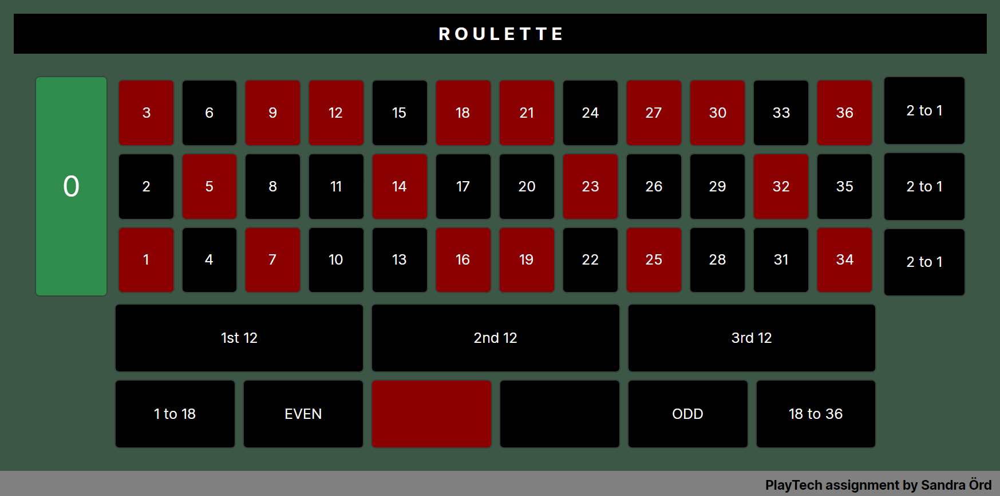

# Roulette Grid Assignment

**Assignment from:** Playtech  
**Completed by:** Sandra Örd

## Table of Contents

1. [Overview](#overview)
2. [Result](#result)
3. [Project Structure](#project-structure)
4. [Running the Project](#running-the-project)

---

## Overview

The assignment focused exclusively on recreating the user interface of a roulette betting grid. No game logic or roulette mechanics were required.

Assignment instructions:  
*Implement application in .Net using WPF or Avalonia UI technology for showing Roulette grid visually.*

The repository includes:

- Avalonia UI solution
- Screenshot of the completed layout

---

## Result



*Completed implementation of the roulette betting grid.*

---

## Technologies

- C#
- .NET
- Avalonia UI

---

## Running the Project

### Prerequisites

Before running the application, ensure you have the following installed:
- .NET SDK 8 or later

### Running the Application

1. Open a terminal and navigate to the solution directory.
    ```bash
    cd RouletteSolution
    ```
2. Restore the project dependencies.
    ```bash
    dotnet restore
    ```
4. Run the application.
    ```bash
    dotnet run --project RouletteGrid
    ```

---